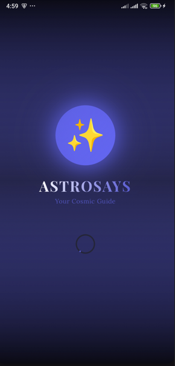
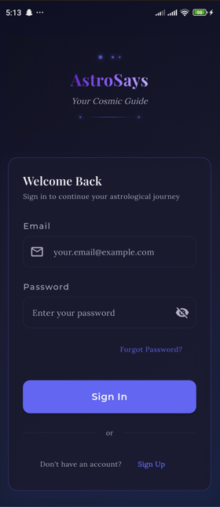
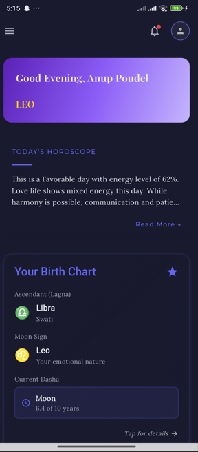
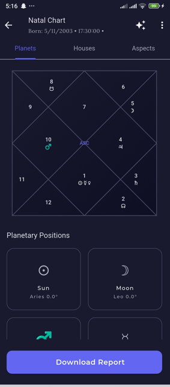
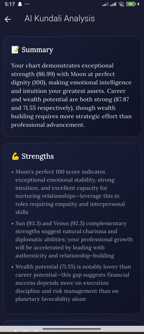
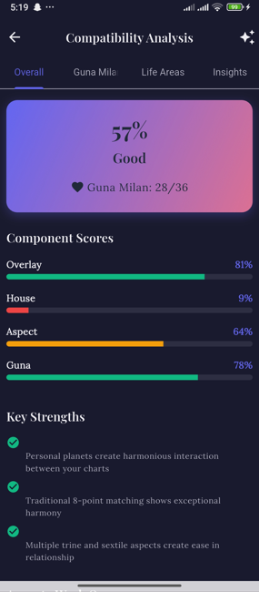
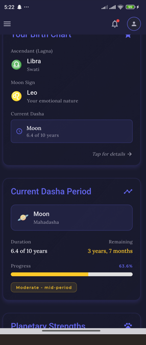
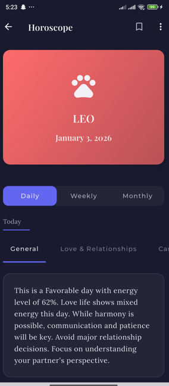
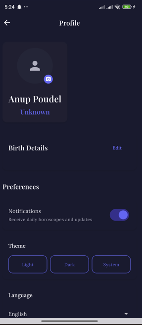

# Kundali Astrology Platform

A full-stack AI-powered Vedic astrology application that combines ancient astrological wisdom with modern machine learning to deliver personalized birth charts, life predictions, and compatibility analysis.

## What This Does

Ever wondered what the stars have to say about you? This platform takes your birth details (date, time, location) and generates a complete Kundali (Vedic birth chart) with AI-driven insights. It's built for people who want accurate astrological readings backed by real astronomical calculations, not generic horoscopes.

**The cool parts:**
- Calculates your exact planetary positions using Swiss Ephemeris (same data NASA uses)
- Machine learning models trained on 15,000+ celebrity birth charts to predict life outcomes
- Real-time planetary transits showing what's happening in the sky right now
- Compatibility matching using traditional Guna Milan scoring
- AI analysis powered by Claude that explains everything in plain English

## App Screenshots


### Mobile App (Flutter)

<table>
  <tr>
    <td align="center">
      
      <br />
      <b>Splash Screen</b>
    </td>
    <td align="center">
      
      <br />
      <b>Login Screen</b>
    </td>
    <td align="center">
      
      <br />
      <b>Home Dashboard</b>
    </td>
  </tr>
  <tr>
    <td align="center">
      
      <br />
      <b>Kundali Birth Chart</b>
    </td>
    <td align="center">
      
      <br />
      <b>AI Life Predictions</b>
    </td>
    <td align="center">
      
      <br />
      <b>Compatibility Match</b>
    </td>
  </tr>
  <tr>
    <td align="center">
      
      <br />
      <b>Planetary Transits</b>
    </td>
    <td align="center">
      
      <br />
      <b>Daily Horoscope</b>
    </td>
    <td align="center">
      
      <br />
      <b>User Profile</b>
    </td>
  </tr>
</table>

### Key UI Features

- **Modern Material Design 3** - Clean, intuitive interface with smooth animations
- **Dark Mode Support** - Comfortable viewing in any lighting condition
- **Responsive Layout** - Seamlessly adapts to phones, tablets, and web browsers
- **Astrology-Themed Colors** - Custom color palette inspired by planets and zodiac elements
- **Interactive Charts** - Swipe through planetary positions, tap for detailed info
- **Offline Mode** - Access your saved charts even without internet

**To add your screenshots:**
```bash
# Create screenshots folder in project root
mkdir screenshots

# Add your app screenshots (PNG or JPG)
# Name them according to the table above:
# - splash_screen.png
# - login.png
# - home.png
# - birth_chart.png
# - predictions.png
# - compatibility.png
# - transits.png
# - horoscope.png
# - profile.png
```

## Tech Stack

**Backend (FastAPI + Python)**
- FastAPI for the REST API
- MongoDB for user data and saved charts
- Swiss Ephemeris for astronomical calculations
- XGBoost ML models for predictions
- Claude API for AI-generated insights (optional)

**Frontend (Flutter)**
- Cross-platform (Android, iOS, Web)
- Material Design 3
- Custom astrology-themed UI components
- Offline support with Hive

**Data & ML**
- 15,000+ labeled celebrity birth charts
- Trained XGBoost models (99.7% R² accuracy)
- Feature engineering from planetary positions, house lords, yogas, and aspects

## Project Structure

```
.
├── server/                    # Python backend
│   ├── routes/               # API endpoints
│   │   ├── auth.py           # User auth (JWT)
│   │   ├── kundali.py        # Birth chart generation
│   │   ├── predictions.py    # Life predictions
│   │   ├── compatibility.py  # Relationship matching
│   │   ├── ai_analysis.py    # AI-powered insights
│   │   └── horoscope.py      # Daily/weekly/monthly horoscopes
│   │
│   ├── ml/                   # Machine learning
│   │   ├── train_models.py   # Model training
│   │   ├── predictor.py      # Inference
│   │   └── feature_extractor.py
│   │
│   ├── services/             # Business logic
│   │   ├── logic.py          # Kundali calculations
│   │   ├── compatibility_service.py
│   │   ├── llm_analysis_service.py
│   │   └── token_tracker.py  # LLM usage tracking
│   │
│   ├── utils/                # Utilities
│   │   ├── astro_utils.py    # Planetary calculations
│   │   ├── strength_calculator.py  # Shad Bala
│   │   └── varga_calculator.py     # Divisional charts
│   │
│   ├── swisseph_data/        # Ephemeris files (planetary positions)
│   └── main.py               # App entry point
│
├── client/                   # Flutter frontend
│   ├── lib/
│   │   ├── core/            # Theme, widgets, navigation
│   │   ├── data/            # API client, models
│   │   └── presentation/    # UI screens
│   └── pubspec.yaml
│
├── trained_models/           # ML model artifacts
│   ├── xgboost_model.pkl    # Main prediction model
│   ├── scaler.pkl           # Feature normalization
│   └── feature_names.json   # Model metadata
│
├── raw_data/                 # Celebrity birth data
└── processed_data/           # Cleaned training data
```

## Quick Start

### Prerequisites

- **Python 3.12+** (backend)
- **Flutter 3.0+** (frontend)
- **MongoDB 5.0+** (database)
- **Git** (obviously)

### Backend Setup

1. **Clone and navigate**
```bash
git clone https://github.com/DoIcode-404/AI-Powered-Astrology.git
cd AI-Powered-Astrology/server
```

2. **Create virtual environment**
```bash
python -m venv venv
source venv/bin/activate  # On Windows: venv\Scripts\activate
```

3. **Install dependencies**
```bash
pip install -r requirements.txt
```

4. **Set up environment variables**
```bash
cp .env.example .env
# Edit .env with your MongoDB URI and optional Anthropic API key
```

5. **Start MongoDB** (if not running)
```bash
mongod --dbpath /path/to/your/data
```

6. **Run the server**
```bash
uvicorn main:app --reload --host 0.0.0.0 --port 8000
```

The API will be live at `http://localhost:8000`. Check `http://localhost:8000/health` to verify.

### Frontend Setup

1. **Navigate to client**
```bash
cd ../client
```

2. **Install Flutter dependencies**
```bash
flutter pub get
```

3. **Update API URL** in `lib/core/config/app_config.dart`
```dart
static const String apiBaseUrl = apiBaseUrlNetworkIP; // For physical device
// OR
static const String apiBaseUrl = apiBaseUrlLocalhost; // For localhost testing
```

4. **Run the app**
```bash
flutter run
# Or for web
flutter run -d chrome
```

## API Endpoints

All endpoints return JSON in this format:
```json
{
  "status": "success",
  "success": true,
  "data": { ... },
  "message": "Operation successful",
  "timestamp": "2025-01-03T10:30:00Z"
}
```

### Authentication

**POST** `/api/auth/register`
```json
{
  "email": "user@example.com",
  "password": "SecurePass123",
  "name": "John Doe"
}
```

**POST** `/api/auth/login`
```json
{
  "email": "user@example.com",
  "password": "SecurePass123"
}
```
Returns JWT tokens for authentication.

### Kundali Generation

**POST** `/api/kundali/generate`
```json
{
  "birthDate": "1990-01-15",
  "birthTime": "14:30:00",
  "latitude": 28.6139,
  "longitude": 77.2090,
  "timezone": "Asia/Kolkata"
}
```

Returns complete birth chart with:
- Planetary positions (degrees, signs, houses)
- Ascendant (Lagna)
- Nakshatras
- Shad Bala (planetary strengths)
- Yogas (auspicious/inauspicious combinations)
- Dasha periods (planetary cycles)

### AI Analysis

**POST** `/api/ai-analysis`
```json
{
  "user_kundali": {
    "birthDate": "1990-01-15",
    "birthTime": "14:30:00",
    "latitude": 28.6139,
    "longitude": 77.2090
  },
  "context": "career"
}
```

Returns ML predictions + AI-generated text analysis covering:
- Career potential (0-100 score)
- Wealth prospects
- Marriage happiness
- Health status
- Spiritual inclination
- Life ease score

### Compatibility

**POST** `/api/compatibility/analyze`
```json
{
  "user_kundali": { ... },
  "partner_kundali": { ... }
}
```

Returns Guna Milan score (out of 36 points) plus detailed koota analysis.

### Horoscopes

**GET** `/api/predictions/horoscope/daily?zodiac_sign=aries`

**GET** `/api/predictions/horoscope/weekly?zodiac_sign=taurus`

**GET** `/api/predictions/horoscope/monthly?zodiac_sign=gemini`

## ML Model Details

The prediction models are trained on:
- **Dataset:** 15,729 celebrity birth charts
- **Features:** 54 astrological features
  - Planetary degrees (Sun, Moon, Mercury, Venus, Mars, Jupiter, Saturn, Rahu, Ketu)
  - House occupations and lord strengths
  - Planetary strengths (Shad Bala scores)
  - Yoga counts (benefic, malefic, neutral)
  - Aspect strengths
- **Model:** XGBoost Regressor
- **Performance:**
  - Test R²: 0.997 (99.7% accuracy)
  - Test MAE: 0.079
  - Test MSE: 0.258

**Training the models:**
```bash
cd server/ml
python train_models.py
```

This generates:
- `trained_models/xgboost_model.pkl` (main model)
- `trained_models/scaler.pkl` (feature normalizer)
- `trained_models/feature_names.json` (metadata)
- `trained_models/model_metrics.json` (performance stats)

## Environment Variables

Create a `.env` file in the server directory:

```env
# MongoDB
MONGODB_URI=mongodb://localhost:27017/kundali
MONGODB_DB_NAME=kundali

# Optional: Claude AI (for enhanced text analysis)
ANTHROPIC_API_KEY=sk-ant-your-api-key-here

# Server
SERVER_PORT=8000
SERVER_HOST=0.0.0.0
DEBUG=false

# Logging
LOG_LEVEL=INFO
```

**Note:** The app works fine without the Anthropic API key. It falls back to rule-based text generation.

## Deployment

### Backend (Railway / Render / DigitalOcean)

1. **Set environment variables** on your platform
2. **Add Procfile** (already included):
```
web: uvicorn server.main:app --host 0.0.0.0 --port $PORT
```
3. **Push to deploy**

The app auto-detects platform environment and uses production settings.

### Frontend (Web)

```bash
cd client
flutter build web
# Deploy the build/web/ folder to Netlify, Vercel, or Firebase Hosting
```

### Frontend (Mobile)

**Android:**
```bash
flutter build apk --release
# Upload to Google Play Console
```

**iOS:**
```bash
flutter build ipa
# Upload via Xcode or App Store Connect
```

## How It Actually Works

1. **User enters birth details** → Flutter app sends POST request
2. **Swiss Ephemeris calculates** exact planetary positions at that moment in time
3. **Feature extractor** converts raw positions into ML-friendly features:
   - Normalizes planetary degrees
   - Calculates house lord strengths
   - Counts benefic/malefic yogas
   - Computes aspect strengths
4. **XGBoost model predicts** 8 life outcome scores (career, wealth, marriage, etc.)
5. **LLM service** (optional) takes the scores and generates human-readable insights
6. **API returns** structured JSON with scores, charts, and text analysis
7. **Flutter app** displays beautiful visualizations and predictions

## Troubleshooting

**Server won't start:**
```bash
# Check if port 8000 is in use
lsof -i :8000  # macOS/Linux
netstat -ano | findstr :8000  # Windows

# Kill existing process or change port in .env
```

**MongoDB connection error:**
```bash
# Make sure MongoDB is running
mongod --dbpath /path/to/data

# Check connection string in .env
MONGODB_URI=mongodb://localhost:27017/kundali
```

**ML predictions returning zeros:**
```bash
# Train the models first
cd server/ml
python train_models.py

# Check if model files exist
ls trained_models/
```

**Flutter build errors:**
```bash
flutter clean
flutter pub get
flutter run
```

## What's Next?

- [ ] Vedic transit predictions (Gochara)
- [ ] Muhurta (auspicious timing) calculator
- [ ] Prashna (horary) astrology
- [ ] Remedies and gemstone recommendations
- [ ] Multi-language support (Hindi, Sanskrit)
- [ ] Social features (share charts, find compatible matches)

## Credits

- **Swiss Ephemeris:** Astronomical calculations by Astrodienst AG
- **Celebrity Data:** Aggregated from AstroSeek, VedAstro, and public sources
- **ML Framework:** XGBoost by DMLC
- **AI Analysis:** Anthropic Claude API
- **Frontend:** Flutter by Google

## License

MIT License - feel free to use this for your own projects. If you build something cool, let me know!

## Contributing

Found a bug? Have a feature idea? Open an issue or submit a PR. I'm always looking for ways to make this better.

**Development setup:**
1. Fork the repo
2. Create a feature branch (`git checkout -b feature/amazing-feature`)
3. Make your changes
4. Run tests (`pytest` for backend, `flutter test` for frontend)
5. Commit (`git commit -m 'Add amazing feature'`)
6. Push (`git push origin feature/amazing-feature`)
7. Open a Pull Request

---

Built with ❤️ and a healthy dose of planetary wisdom.

*Last updated: January 2026*
